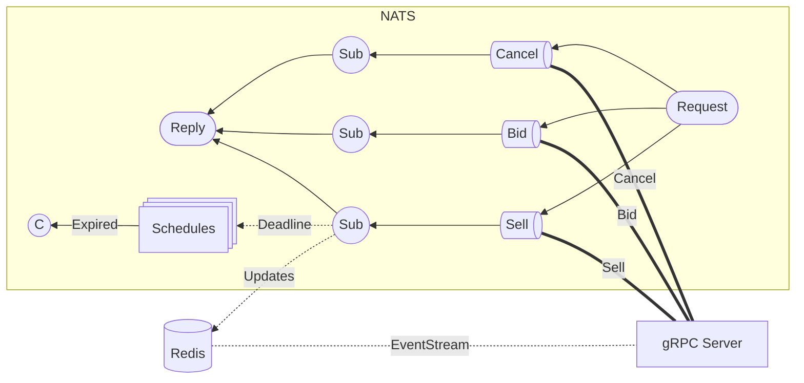

# Auction

Go service that runs an auction workflow over a gRPC server.



See the [contracts](https://github.com/xdward/auction-contracts) repository for service definitions.

## Features

- Requests are queued through NATS for low latency and high throughput
- Auction state is stored in Redis for persistency and fast read/writes
- Atomic operations through Redis transactions for safe concurrent updates
- Snapshots and real-time updates for client synchronization

## Local Development

Setup `.env` with the following variables:

```
REDIS_PASS=***
NATS_TOKEN=***
```

Start the service:

```bash
docker compose up -d --build
```
